# Linux_Terminal_Chat_App
Creating Chat Application like Whatsapp but From Terminal
# Chat Application (Terminal-based)

## 1. Introduction

This project presents the development of a multi-user messaging application designed to operate in a client-server architecture without a graphical user interface (GUI). The application is implemented in C and consists of two separate programs: `server.c` and `client.c`, both of which run independently on localhost.

The server-side program continuously listens to client requests, manages and stores user lists for each client, delivers messages to appropriate users, and sends alert notifications. It maintains crucial user information such as Username (a unique identifier), Mobile Phone Number, Name-Surname, contact list, user list, and messages.

On the client side, users can display their contact list, add contacts, check, write, send, and receive messages, and view message histories. Each client logs into the system with a unique Username, and the server compares this username against its stored user list, registering new users as needed.

In the context of this application, the client connects to the server and sends requests based on user actions. The server, in turn, accepts these connections and processes various requests, such as user registration, message sending, and message checking. Both client and server use sockets for communication over the network.

## 2. Main Content

### 2.1 User Story

Initially, users are presented with an interactive screen and must log in to proceed. Any attempts to perform actions before logging in will prompt a message directing them to the login process.

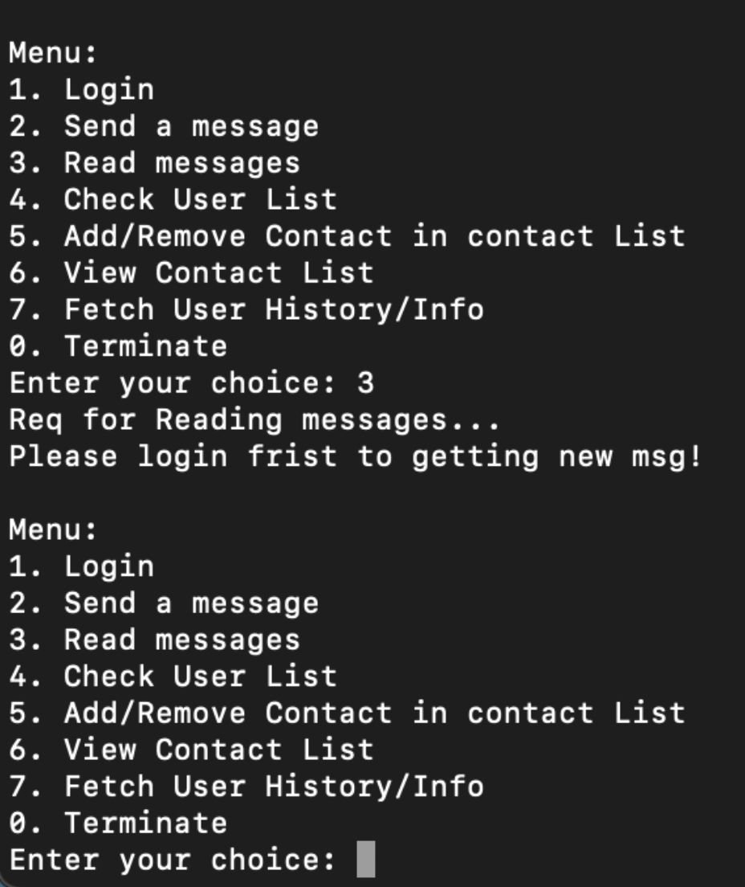

Upon accessing the system, the user is required to input several key parameters: username, name, phone number, and surname.

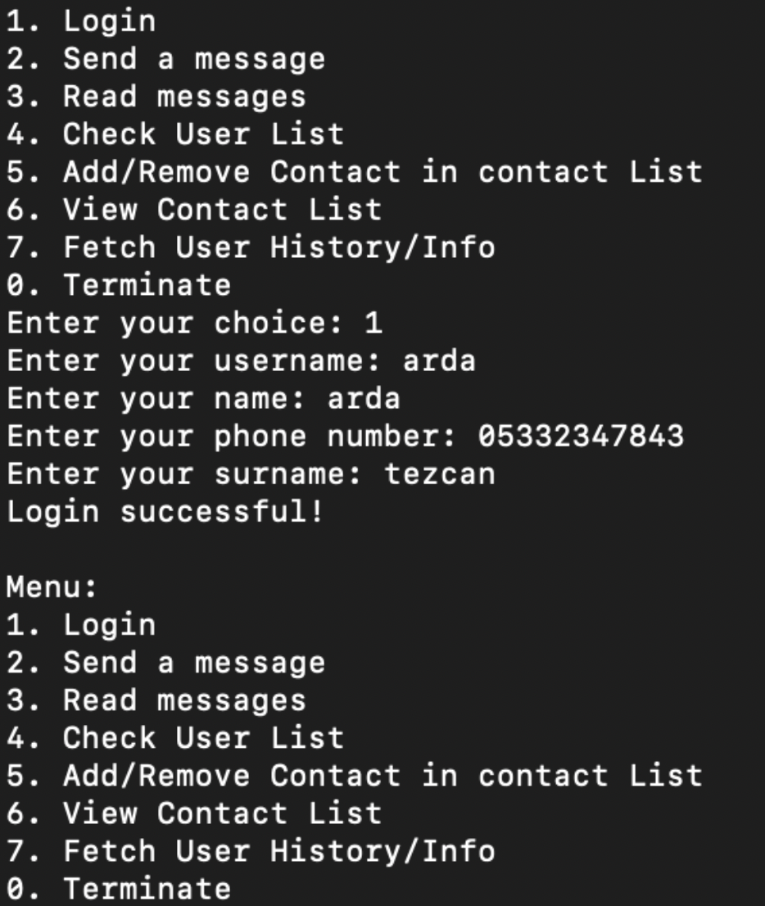

If a user attempts to register with a username that already exists, the system displays a message indicating that the username is already in use.

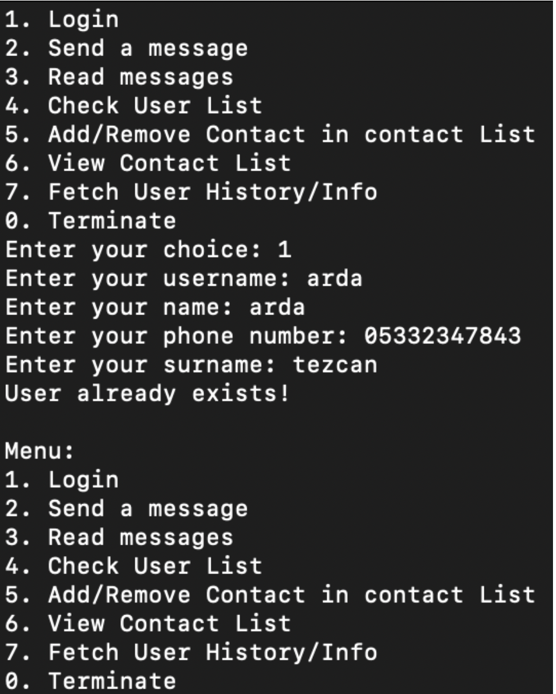

If the user wishes to send a message, they must first add the recipient to their contact list, which initially appears empty. The system displays available usernames as options. The user can then choose to add or remove a username from their list by pressing 1 (add) or 2 (remove) corresponding to the desired username.

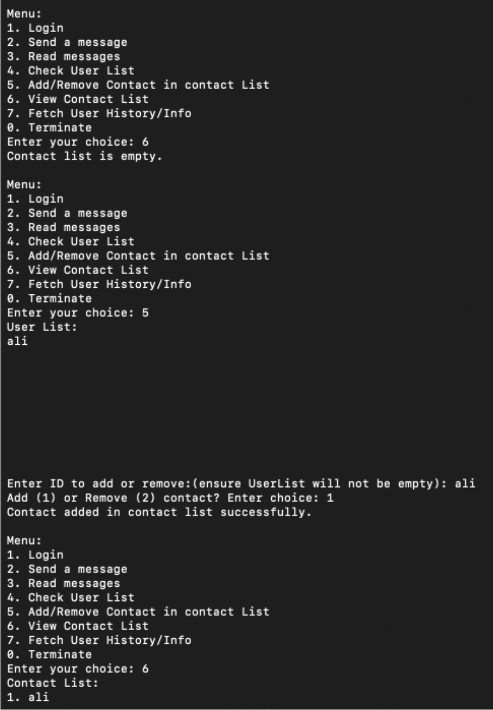

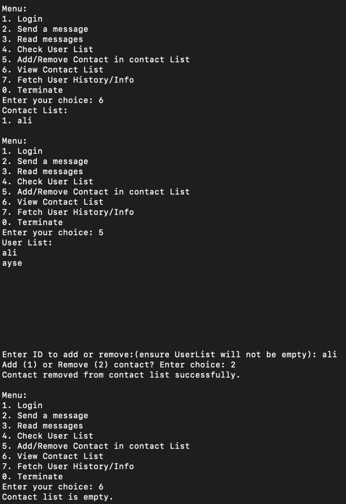

Once added to the contact list, the user can send messages to the chosen recipient, who can then instantly read the incoming messages.

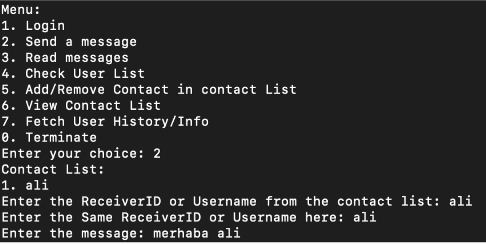

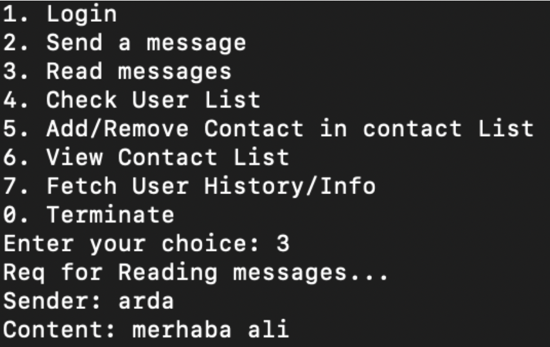

Not all users in the user list are automatically in the contact list; they must be manually added by the user. Also, the current user does not show in the user list.

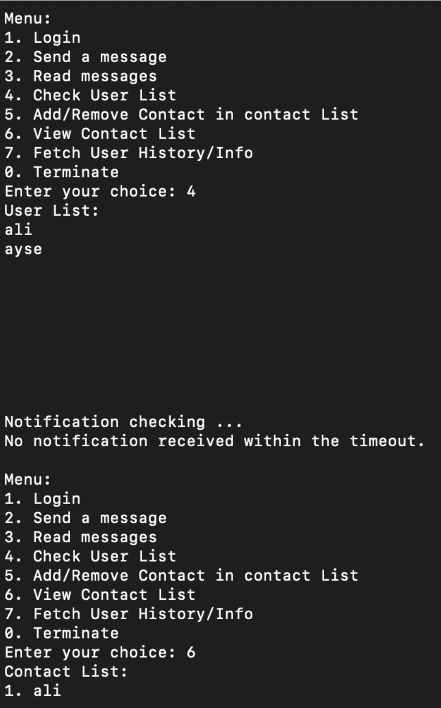

During any activity, such as adding a user to the contact list, incoming messages are promptly notified with a "New message from `<userName>`" alert.

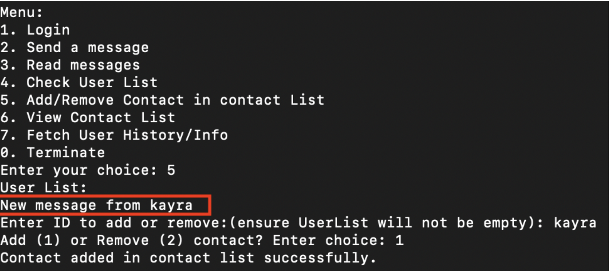

If the user wants to view the user’s history and information, the user can do so by pressing 7.

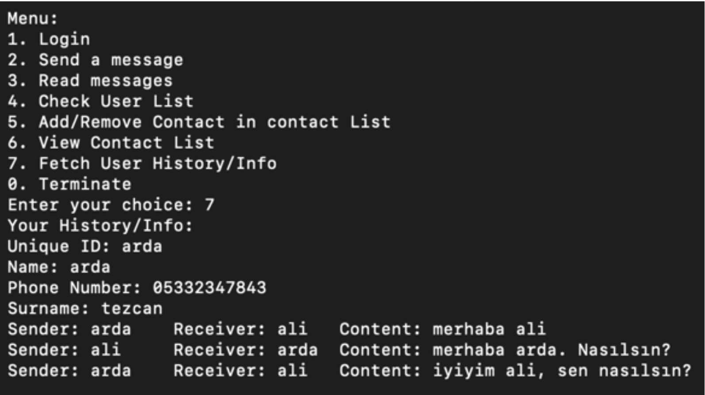

To terminate the session, the user simply needs to select option 0.

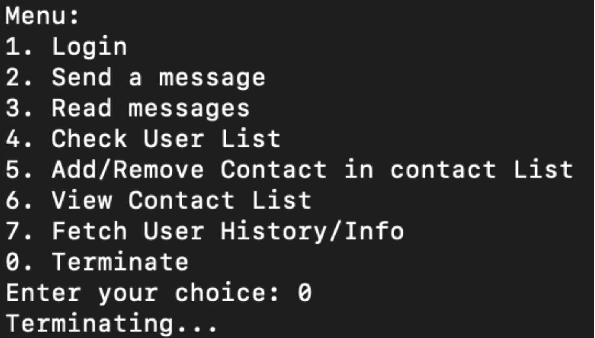

Additionally, if the user terminates the program and logs in again, their message history will be accessible again.

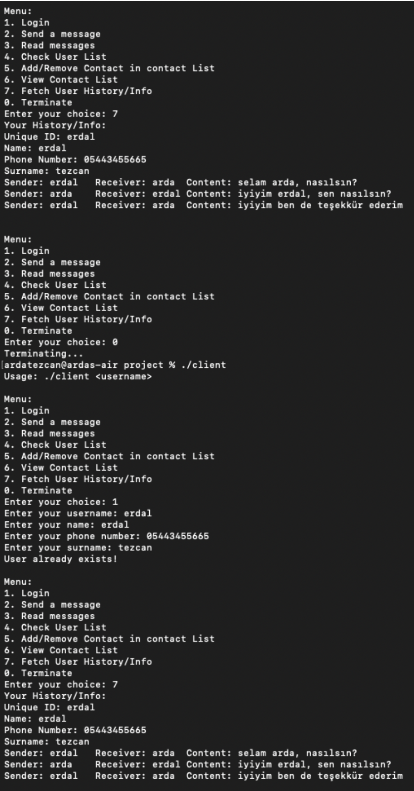
